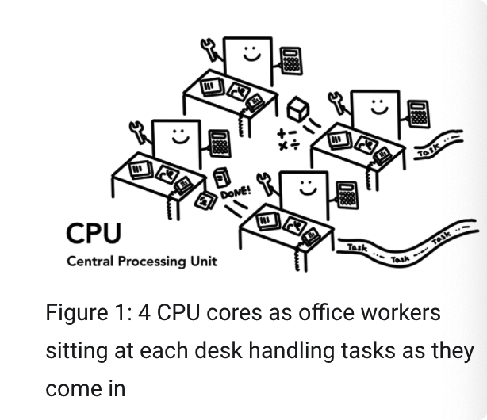
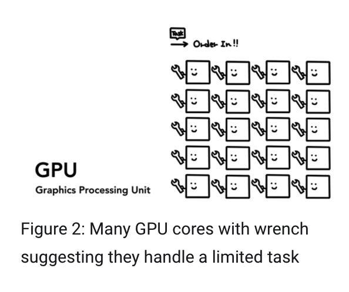
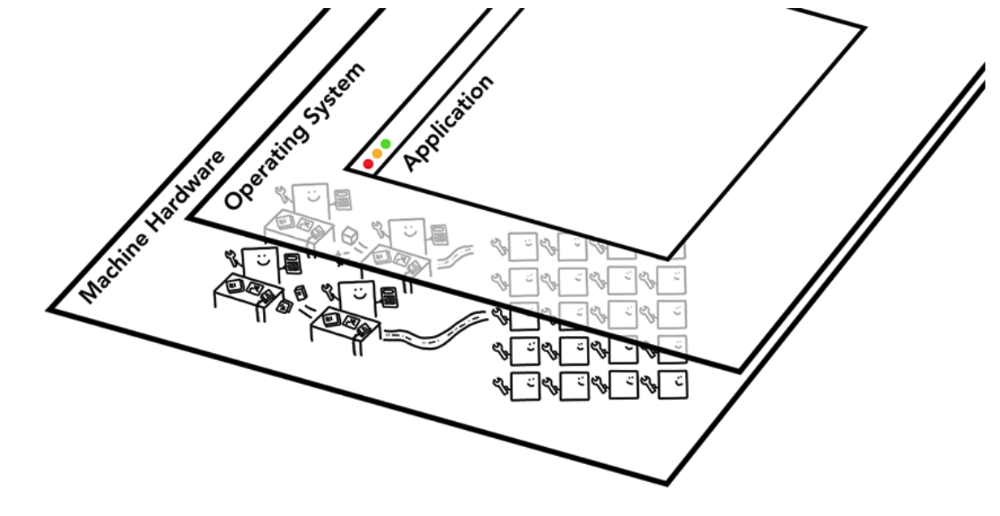
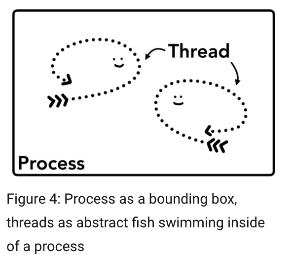

  look at modern web browser (part 1)

[^现代浏览器的内部实现机制]: 

Tag: CPU/GPU/存储介质()/多线程机制 

[^CPU, GPU, Memory, and multi-process architecture]: 

如果你曾经好奇过浏览器是怎么将你的代码转化成功能型网站，又或者你不确定为什么一个特定技术会被用来作为表现优化，那这个系列就是给你准备的。

part1

我们将会聚焦在 核心计算术语 和谷歌浏览器的多线程机制上；

CPU，全称是 Central Processing Unit 中央处理单元，作为计算机的“大脑”。一个计算机内核以下图的形象展现出来：



​                                          picture as an office worker

1.can handle many different tasks one by one as they come in

单核 single chip ： a core is like another CPU living in the same chip.

GPU  全称是 Graphics Processing Unit 图像处理单元；不同于CPU，GPU擅长于同时across multiple cores处理处理简单任务（handling simple tasks）



多核，仅处理某种任务




操作系统构建了应用层，通过调度 CPU 和 GPU 等相关硬件来为应用层提供服务；

## Executing program on Process and Thread

在进程 和线程上执行程序

another concept to grasp  before diving into browser architecture is Process and Thread.


a process can be described as an application's executing program.

a thread is the one that lives inside  of process and executes any part of  its process's program .


进程是应用的执行态

线程是在进程内部，并且执行着 进程的一部分。



进程是封闭之池

线程是一尾抽象之鱼游弋其中

当你开始(执行)一个应用程序，这个程序可能会创建 线程(们)来帮助执行任务。 but its's optional。

操作系统提供给 进程 a "slab" of memory to work with  and  all application state  is kept in that private memory space.

所有的应用程序都在(那块)私有存储空间上

when you close the application,the process also goes away and the Operateing System frees up the memory


一个进程可以请求操作系统去轮巡调度(to spin up唱片机旋转)不同的任务(tasks).

这个时候，存储空间的其他(某个)部分会被分配一个新的进程。如果两个进程需要通信，他们可以借助 Inter Process Communication(IPC)内部进程通信；许多应用都是通过这种方式设计的，当一个工作进程反应迟钝(unresponsive)，他可以在不终止其他的 运行应用程序不同部分 的进程的情况下 重启。

It can be restarted without stopping other processes wihch are running different  parts of the application.(the application 同一个应用程序的不同部分)


next part https://developers.google.com/web/updates/2018/09/inside-browser-part1

```
https://developers.google.com/web/updates/2018/09/inside-browser-part1#browser-architecture
```

Browser Architecture

浏览器架构

web浏览器是怎么使用进程和线程的？

1个进程(伴随 with)许多不同的线程  或者许多进程(伴随) 少量线程 借助IPC进行通信。


​                                          不同浏览器架构的 进程/线程 拓扑

这些不同的架构是实现细节，并没有特定的标准来指导 构建浏览器这件事情。

一个浏览器相同的功能可能会完全区别于另外一个。

One browser's approach may be  completely different  from another.

所以接下来还是会从谷歌最近的架构作为举例：

1. 最先是 浏览器进程协调其他的 浏览器进程们 关注应用程序的不同部分。
2. 为了渲染进程，多个进程被创建并且被分配给每一个tab 栏。知道最新的版本中，谷歌浏览器还是会尽可能的给每一个tab分配一个进程。现在他会尝试给每一个 站点(each site)属于他自己的进程，包括iframes标签。


​                  谷歌浏览的多线程架构：在渲染进程下,显示多个层级表明谷歌浏览器正为每一个tab运行着多渲染进程

Which process controls what?

哪一个浏览器管控什么？

Process and what is controls

Browser controls "chrome" part of the application including address bar,back and forward buttons

Renderer -- control anything inside of tab where a website is display

Plugin   -- controls any plugins used by website ,for ex, flash

GPU  -- handles GPU tasks in isolation from other processes.it is separated  into different process because GPUs handles requests from multiple apps and draw them in the  same surface .

独立处理GPU任务。GPU进程是独立于其他的进程的，因为他需要处理其他多应用的需求，并且在同一个平面上进行绘制。


   Different process pointing to different parts of browser UI


The benefit of  multi-process architecture in Chrome

谷歌浏览器多进程架构的优点

谷歌浏览器是多渲染线程架构。你可以想象每一个tab 都有一个自己的渲染进程。

如果你打开了三个标签页并且每一个标签都运行着一个独立的渲染进程。如果一个标签了没有回应的状态，你可以关闭没有回应的标签页，其他的保持活跃。如果所有的标签页都运行在同一个进程上面，都有一个标签页面不响应的时候，其他所有的标签页都不响应。

另外，讲浏览器的工作分摊到多个不同的进程中更安全，也是一种沙盒机制。自从操作系统提供了限制(restrict) 进程的权力，浏览器可以将核心功能沙盒化核心进程。比如，谷歌浏览器可以通过限制进程(比如渲染进程)访问任意文件(arbitrary file)来达到处理任意用户的输入。

因为进程都有自己的私有存储空间，他们经常包含公共基础设置的副本(比如谷歌浏览器的JS引擎V8)

[^they often contain copies of common infrastructure(like V8 which is a Chrome's JS engine)]: 


Saving more memory  --Servicification in Chrome

[servicification] 服务

保存更多的记忆，谷歌浏览器上的服务

The same approach is applied to browser process.相同功能是申请调用浏览器进程。谷歌接受(基于)架构变化来将浏览器程序作为 不同进程或者统一整体来运行的服务。

通常的方法是 当谷歌浏览器运行在一个强劲的硬件设备上时，他可能会将每一个服务分到不同的进程中从而提高稳定性。(it may split each service into different processes giving more stability),but if it is on a resource-constraint device(resource-constraint 资源受限)。谷歌会将服务整合进一个进程中节省存储空间。 chrome consolidates  services into one process saving memory footprint.

~~相似的功能合并成一个进程，更少的存储空间使用在类似安卓上被~~

在类似安卓这样的平台上，相似的功能通过合并成一个进程来减少存储空间的占用。


谷歌的服务 合并或者分布


Pre-frame renderer processes - Site Isolation

预架构渲染进程 站点隔离

------

## What is Site Isolation?

The internet is for watching cat videos and managing cryptocurrency wallets, amongst other things — but you wouldn’t want `fluffycats.example` to have access to your precious cryptocoins! Luckily, websites typically cannot access each other’s data inside the browser thanks to the Same-Origin Policy. Still, malicious websites may try to bypass this policy to attack other websites, and occasionally, security bugs are found in the browser code that enforces the Same-Origin Policy. The Chrome team aims to fix such bugs as quickly as possible.

*Site Isolation* is a security feature in Chrome that offers an additional line of defense to make such attacks less likely to succeed. It ensures that pages from different websites are always put into different processes, each running in a sandbox that limits what the process is allowed to do. It also blocks the process from receiving certain types of sensitive data from other sites. As a result, with Site Isolation it’s much more difficult for a malicious website to use speculative side-channel attacks like Spectre to steal data from other sites. As the Chrome team finishes additional enforcements, Site Isolation will also help even when an attacker’s page can break some of the rules in its own process.

**Site Isolation effectively makes it harder for untrusted websites to access or steal information from your accounts on other websites.** It offers additional protection against various types of security bugs, such as [the recent Meltdown and Spectre side-channel attacks](https://developers.google.com/web/updates/2018/02/meltdown-spectre).

For more details on Site Isolation, see [our article on the Google Security blog](https://security.googleblog.com/2018/07/mitigating-spectre-with-site-isolation.html).

------

站点隔离（其实就是不同页面运行在不同进程的沙盒机制）谷歌浏览器中最近被介绍的功能，为每一个 （不同源，跨域，，这里的翻译应该是错的 each cross-site iframe）单独开一个渲染进程。

我们在上文有谈到过每一个tab（标签页）都有一个渲染进程的模式，这种模式也会允许跨域iframes 运行到耽搁渲染进程中，在不同的站点之间分享存储空间。运行一个 a.com 和b.com在相同的渲染进程可能看起来是OK的。同源策略就是网站的核心安全模型。它确保一个站点不会未经同意（without consent）去访问另外一个站点的数据。

绕开这个下一世安全攻击的首要目标，进程隔离是隔离站点最有效的方式。With [Meltdown and Spectre](https://developers.google.com/web/updates/2018/02/meltdown-spectre), it became even more apparent that we need to separate sites using processes. With Site Isolation enabled on desktop by default since Chrome 67, each cross-site iframe in a tab gets a separate renderer process.


Diagram of site isolation; multiple renderer processes pointing to iframes within a site
